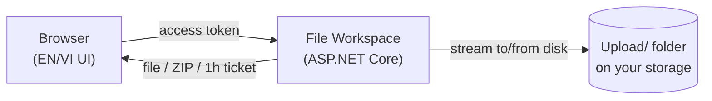
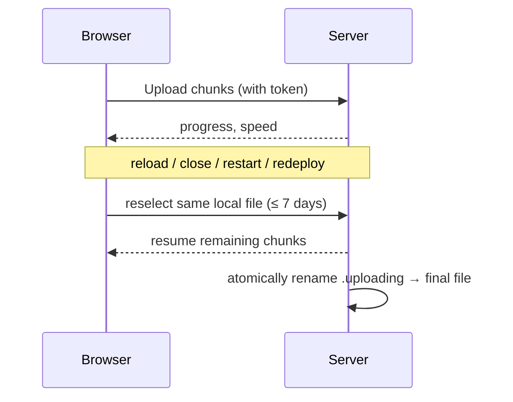
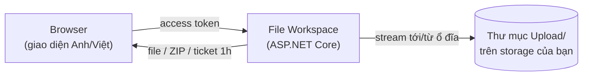
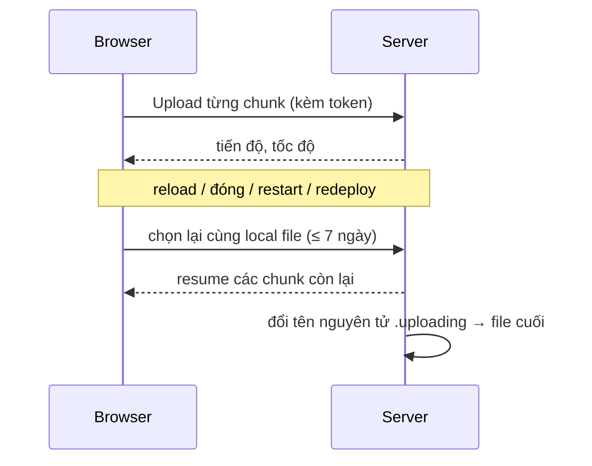

# File Workspace — Self-hosted File Manager

> A private, token-protected file workspace for trusted users and infrastructure you control.

[English](#english) · [Tiếng Việt](#tiếng-việt)

## English

Self-hosted, cloud-style file manager built with ASP.NET Core. A trusted group can browse folders, upload large files with resume, and download files or ZIP archives — all behind one shared access token. It is **not** a multi-tenant cloud drive: no accounts, roles, sharing links, quotas, or recycle bin.

### Architecture



### Resumable upload, at a glance



### Key features

- Browse, create folders, and delete selected files/folders after confirmation.
- Download one file or ZIP a selection (including empty folders).
- One-hour, one-file download ticket — works with IDM/Range-resume without exposing the shared token.
- Drag-and-drop upload, including whole folders; per-file pause/resume/stop.
- Streamed, resumable chunk uploads that survive reload, browser close, server restart, or redeploy.
- Collapsible Explorer-style sidebar; responsive on desktop, tablet, and mobile.
- Per-IP rate limiting and a minimal audit log (action/path/IP, never the token) on every `/api/*` request.

More behavior detail (file operations, cleanup rules, operational caveats): [docs/DETAILS.md](docs/DETAILS.md).

### Requirements

- .NET SDK 10 to build/run from source, or ASP.NET Core Runtime 10 for published output.
- A writable `Upload/` directory in the application's content root.
- `UPLOAD_ACCESS_TOKEN` set — the service refuses to start without it.

### Quick start

```env
# .env in the repository root
UPLOAD_ACCESS_TOKEN=replace-with-a-long-random-secret
```

```powershell
# Windows convenience script
./Start-Server.ps1
```

```text
# or run from source on any supported platform
dotnet run --urls http://127.0.0.1:5088
```

Open `http://127.0.0.1:5088` and enter the token. `.env` is Git-ignored — never commit it.

Prefer a prebuilt package? Download Windows x64 / Linux x64 / Linux ARM64 from the [latest release](https://github.com/AnhBuiDeveloper/FileWorkspace/releases/latest), verify against `SHA256SUMS.txt`, then set `UPLOAD_ACCESS_TOKEN` and run `dotnet FileWorkspace.dll`.

### Deployment

Runs anywhere ASP.NET Core 10 does: Windows, Linux (x64/ARM64), containers, VMs, or a managed platform. Provide the token via env var, secret manager, or `.env`, then:

```text
dotnet FileWorkspace.dll --urls http://127.0.0.1:5088
```

An optional Linux systemd + Nginx reference is in [`deploy/`](deploy/README.md) — an example to adapt, not a requirement.

### Quality checks

```text
npm ci
npx playwright install chromium
npm run test:all
dotnet format --verify-no-changes --no-restore
```

Unit, API-integration, and Playwright UI tests cover resumable upload, download tickets, and file-manager behavior; CI runs all of them on every push/PR. Details: [docs/DETAILS.md](docs/DETAILS.md).

### Security, contributions, and licensing

Read [SECURITY.md](SECURITY.md) before reporting a vulnerability, and [CONTRIBUTING.md](CONTRIBUTING.md) before opening a pull request. UI contributions must meet the [Responsive UI standard](UI-STANDARDS.md). Architecture rules live in [PROJECT-MEMORY.md](PROJECT-MEMORY.md).

This project is **source-available** (not OSI Open Source), licensed under [PolyForm Noncommercial 1.0.0](LICENSE): free for non-commercial use; commercial use needs a separate agreement — see [COMMERCIAL-LICENSE.md](COMMERCIAL-LICENSE.md), [NOTICE](NOTICE), [ENFORCEMENT.md](ENFORCEMENT.md).

---

## Tiếng Việt

File manager tự host, theo hướng cloud-style, xây bằng ASP.NET Core. Nhóm người dùng tin cậy có thể duyệt folder, upload file lớn có resume, tải file hoặc ZIP — tất cả sau một shared access token. **Không phải** cloud drive đa người dùng: chưa có tài khoản, role, link chia sẻ, quota hay thùng rác.

### Kiến trúc



### Upload có thể resume, tóm tắt



### Tính năng chính

- Duyệt, tạo folder, xóa file/folder đã chọn sau khi xác nhận.
- Tải một file hoặc ZIP nhiều mục đã chọn (kể cả folder rỗng).
- Ticket tải một file, hiệu lực một giờ — dùng được với IDM/Range-resume mà không lộ shared token.
- Upload kéo-thả, kể cả cả folder; mỗi file có pause/resume/stop riêng.
- Upload theo chunk, stream và resume được qua reload, đóng browser, restart server hoặc redeploy.
- Sidebar kiểu Explorer thu gọn được; responsive trên desktop, tablet, mobile.
- Rate limit theo IP và audit log tối thiểu (action/path/IP, không log token) cho mọi request `/api/*`.

Chi tiết hành vi (thao tác file, quy tắc dọn dẹp, lưu ý vận hành): [docs/DETAILS.md](docs/DETAILS.md).

### Yêu cầu

- .NET SDK 10 để build/chạy từ source, hoặc ASP.NET Core Runtime 10 để chạy bản đã publish.
- Quyền ghi vào thư mục `Upload/` trong content root.
- Bắt buộc có `UPLOAD_ACCESS_TOKEN` — service không khởi động nếu thiếu.

### Khởi chạy nhanh

```env
# .env ở thư mục gốc repository
UPLOAD_ACCESS_TOKEN=thay-bang-token-dai-va-ngau-nhien
```

```powershell
# Script tiện ích cho Windows
./Start-Server.ps1
```

```text
# hoặc chạy từ source trên mọi nền tảng .NET hỗ trợ
dotnet run --urls http://127.0.0.1:5088
```

Mở `http://127.0.0.1:5088` và nhập token. `.env` đã bị Git bỏ qua — tuyệt đối không commit.

Muốn dùng package build sẵn? Tải Windows x64 / Linux x64 / Linux ARM64 từ [release mới nhất](https://github.com/AnhBuiDeveloper/FileWorkspace/releases/latest), kiểm tra bằng `SHA256SUMS.txt`, rồi đặt `UPLOAD_ACCESS_TOKEN` và chạy `dotnet FileWorkspace.dll`.

### Triển khai

Chạy được ở bất kỳ đâu hỗ trợ ASP.NET Core 10: Windows, Linux (x64/ARM64), container, VM hoặc cloud platform. Cấp token qua biến môi trường, secret manager hoặc `.env`, rồi:

```text
dotnet FileWorkspace.dll --urls http://127.0.0.1:5088
```

Cấu hình tham khảo Linux systemd + Nginx nằm ở [`deploy/`](deploy/README.md) — chỉ là ví dụ để bạn điều chỉnh, không bắt buộc.

### Kiểm tra chất lượng

```text
npm ci
npx playwright install chromium
npm run test:all
dotnet format --verify-no-changes --no-restore
```

Unit test, API integration test và Playwright UI test bao phủ upload resume, download ticket và hành vi file manager; CI chạy toàn bộ mỗi push/PR. Chi tiết: [docs/DETAILS.md](docs/DETAILS.md).

### Bảo mật, đóng góp và license

Đọc [SECURITY.md](SECURITY.md) trước khi báo lỗ hổng, và [CONTRIBUTING.md](CONTRIBUTING.md) trước khi mở pull request. Thay đổi UI phải đạt [Tiêu chuẩn UI responsive](UI-STANDARDS.md). Quy tắc kiến trúc nằm ở [PROJECT-MEMORY.md](PROJECT-MEMORY.md).

Dự án **source-available** (không phải Open Source theo OSI), dùng license [PolyForm Noncommercial 1.0.0](LICENSE): miễn phí cho mục đích phi thương mại; thương mại cần thỏa thuận riêng — xem [COMMERCIAL-LICENSE.md](COMMERCIAL-LICENSE.md), [NOTICE](NOTICE), [ENFORCEMENT.md](ENFORCEMENT.md).
